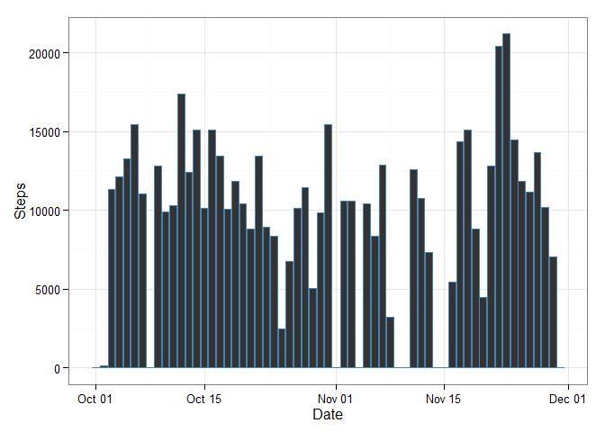

# Reproducible Research: Peer Assessment 1


## Loading and preprocessing the data

```r
data_load <- read.csv("activity.csv")
```

## What is mean total number of steps taken per day?

```r
library(ggplot2)

steps_total <- aggregate(data_load$steps, by=list(data_load$date), FUN = sum, na.rm = TRUE) #Calculating the 
#total number of steps for each day
steps_total[, 1] <- as.Date(steps_total$Group.1, "%Y-%m-%d") #Converting to date
colnames(steps_total) <- c("Date", "Steps") #Changing the names of the column for the matrxi generated by using aggregate
ggplot(steps_total, aes(x = steps_total$Date, y = steps_total$Steps)) + geom_histogram(stat = "identity", col = "steelblue") + xlab("Date") + ylab("Steps") + theme_bw() #Plot
```

 

```r
mean(steps_total[, 2]) #Mean of the steps taken daily
```

```
## [1] 9354.23
```

```r
median(steps_total[, 2]) #Median of the steps taken daily
```

```
## [1] 10395
```


## What is the average daily activity pattern?

```r
daily_pattern <- aggregate(data_load$steps, by=list(data_load$interval), FUN = mean, na.rm = TRUE) #Calculating the average number of steps taken in each interval
colnames(daily_pattern) <- c("Interval", "AvgSteps") # Changing the column names
ggplot(daily_pattern, aes(x = daily_pattern$Interval, y = daily_pattern$AvgSteps)) + geom_line(col ="steelblue") + xlab("Interval") + ylab("Steps") + theme_bw() #Plot
```

 

```r
daily_pattern[which.max(daily_pattern[,2]), 1] #Finding the maximum interval for the number of steps
```

```
## [1] 835
```


## Imputing missing values

```r
sum(is.na(data_load)) #Finding the total number of NAs in the data
```

```
## [1] 2304
```

```r
# Finding out the interval of NA value in Data_load and comparing it with the Interval in Daily_pattern to find out the corresponding average number of steps
for(i in 1 : nrow(data_load)){
    if(is.na(data_load[i, 1])){
        data_load[i, 1] = daily_pattern[which(daily_pattern$Interval == data_load[i, 3]), 2]
    } 
}
print(summary(data_load))
```

```
##      steps                date          interval     
##  Min.   :  0.00   2012-10-01:  288   Min.   :   0.0  
##  1st Qu.:  0.00   2012-10-02:  288   1st Qu.: 588.8  
##  Median :  0.00   2012-10-03:  288   Median :1177.5  
##  Mean   : 37.38   2012-10-04:  288   Mean   :1177.5  
##  3rd Qu.: 27.00   2012-10-05:  288   3rd Qu.:1766.2  
##  Max.   :806.00   2012-10-06:  288   Max.   :2355.0  
##                   (Other)   :15840
```

```r
steps_total_no_na <- aggregate(data_load$steps, by=list(data_load$date), FUN = sum)
colnames(steps_total_no_na) <- c("Date", "Steps")
steps_total_no_na[ , 1] <- as.Date(steps_total_no_na$Date, "%Y-%m-%d")
ggplot(steps_total_no_na, aes(x = steps_total_no_na$Date, y = steps_total_no_na$Steps)) + geom_histogram(stat = "identity", col = "steelblue") + xlab("Date") + ylab("Steps") + theme_bw() #Plot
```

 

```r
mean(steps_total_no_na[, 2]) #Mean of the steps taken daily
```

```
## [1] 10766.19
```

```r
median(steps_total_no_na[, 2]) #Median of the steps taken daily
```

```
## [1] 10766.19
```

## Are there differences in activity patterns between weekdays and weekends?

```r
library(timeDate)
data_load$date <- as.Date(data_load$date, "%Y-%m-%d")
weekDays_data <- subset(data_load, isWeekday(data_load$date, wday=1:5))
weekEnd_data <- subset(data_load, !(isWeekday(data_load$date, wday=1:5)))

weekDays_pattern <- aggregate(weekDays_data$steps, by=list(weekDays_data$interval), FUN = mean) #Calculating the average number of steps taken in each interval
colnames(weekDays_pattern) <- c("Interval", "AvgSteps") # Changing the column names
ggplot(daily_pattern, aes(x = weekDays_pattern$Interval, y = weekDays_pattern$AvgSteps)) + geom_line(col ="steelblue") + xlab("Interval") + ylab("Steps") + theme_bw() + labs(title = "Average Steps per Interval in Weekdays")
```

 

```r
weekEnd_pattern <- aggregate(weekEnd_data$steps, by=list(weekEnd_data$interval), FUN = mean) #Calculating the average number of steps taken in each interval
colnames(weekEnd_pattern) <- c("Interval", "AvgSteps") # Changing the column names
ggplot(daily_pattern, aes(x = weekEnd_pattern$Interval, y = weekEnd_pattern$AvgSteps)) + geom_line(col ="steelblue") + xlab("Interval") + ylab("Steps") + theme_bw() + labs(title = "Average Steps per Interval on Weekend")
```

 

